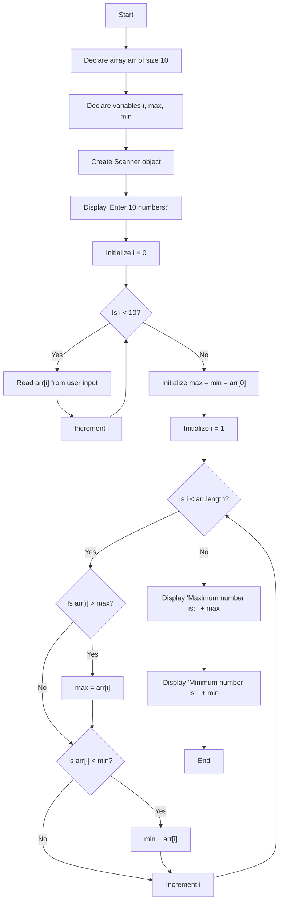

Make sure you have `Python >= 3.12` and `mysql-connector-python` package installed. If not, use `pip install mysql-connector-python` to install that package.

This is just my school project regarding my acquired knowledge of Python in my 2 years of learning in my school.
Feel free to improve it or whatever.

NOTE: I took some help from the internet to make the `formatting.py` for making it look nicer.

# ArrayMaxMin Program Flowchart

This flowchart explains the logic of the ArrayMaxMin program that finds the maximum and minimum values in an array of 10 numbers.

## Code Explanation

1. **Initialization**:
   - Create an integer array of size 10
   - Initialize variables for iteration and storing max/min values
   - Set up Scanner for user input

2. **Input Phase**:
   - Prompt user to enter 10 numbers
   - Read each number into the array using a loop

3. **Processing Phase**:
   - Assume the first element is both max and min
   - Iterate through the remaining elements
   - Update max if a larger element is found
   - Update min if a smaller element is found

4. **Output Phase**:
   - Display the maximum value
   - Display the minimum value
